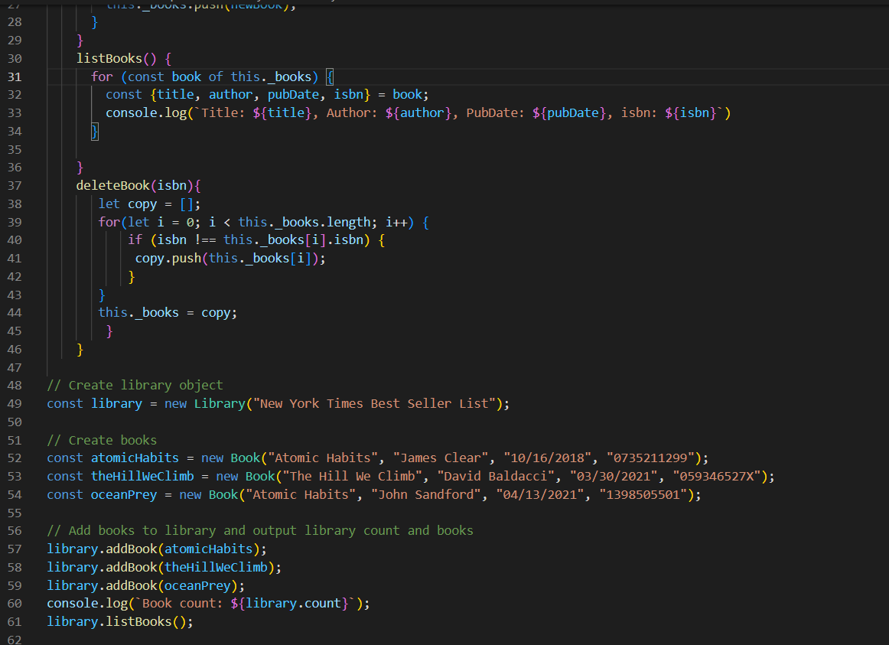

# Lab 6

Learned about classes in Javascript. Understanding key words that refer to objects within a class, 
such as the keyword '.this'. More practice with creating functions in Javascript.

### Skills Used in Project
- Understanding classes
- Creating functions that refer to objects in classes such as:
    - deletebook(): which deletes an object from the class
- Practice with adding objects to classes

